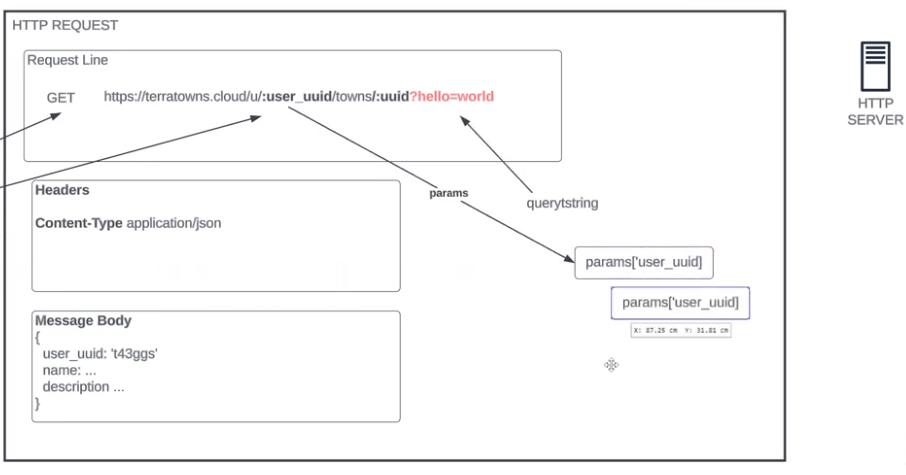
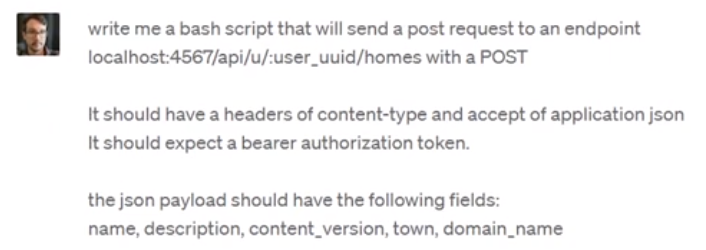
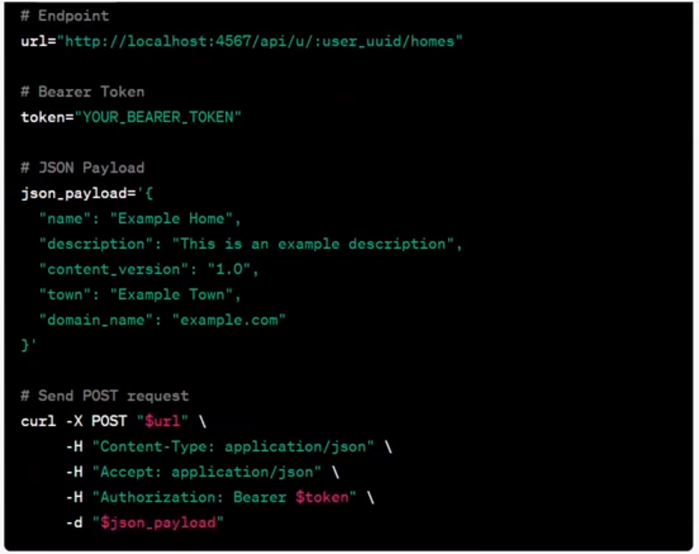

# Terraform Beginner Bootcamp 2023 - Week 2


## Web Servers

Use **Sinatra** for lightweight web server and **Rails** for a heavy duty web server.

Golang Binary will be used for CRUD and call the Provider and Resource in Main.tf.
It will initiate JSON payloads to call corresponding APIs (Create, Read, Update, Delete)
APIs will then be executed in the web servers.

## Clone Repository 
Clone Mock server repository using SSH from GitHub into local GitPod
[Mock Server](https://github.com/ExamProCo/terratowns_mock_server.git)

```sh
git clone https://github.com/ExamProCo/terratowns_mock_server.git
```

Then delete `.git` file created automatically...
Change directory:
```
cd terratowns_mock_server/
```
List all files in directory:
```
ls -la
```
Then remove the `.git` directory:
RM - remove, RF - remove force
```
rm -rf .git
```

## Working with Ruby

### Bundler

Bundler is a package manager for runy.
It is the primary way to install ruby packages (known as gems) for ruby.

#### Install Gems

You need to create a Gemfile and define your gems in that file.

```rb
source "https://rubygems.org"

gem 'sinatra'
gem 'rake'
gem 'pry'
gem 'puma'
gem 'activerecord'
```

Then you need to run the `bundle install` command

This will install the gems on the system globally (unlike nodejs which install packages in place in a folder called node_modules)

A Gemfile.lock will be created to lock down the gem versions used in this project.

#### Executing ruby scripts in the context of bundler

We have to use `bundle exec` to tell future ruby scripts to use the gems we installed. This is the way we set context.

### Sinatra

Sinatra is a micro web-framework for ruby to build web-apps.

Its great for mock or development servers or for very simple projects.

You can create a web-server in a single file.

https://sinatrarb.com/

## Terratowns Mock Server

### Running the web server

We can run the web server by executing the following commands:

```rb
bundle install
bundle exec ruby server.rb
```

All of the code for our server is stored in the `server.rb` file.

Sinatra is a light web framework sinatrarb.com

"Bundle exec ruby server.rb"
Bundle exec --> execute ruby

Ruby rubygems.org

## HTTP Request Template with Sinatra

With Sinatra, the parameters are required but not with Ruby.



### Sinatra Server

Ctrl~C to stop the terraform command line first

#### Start Manually
```sh
bundle exec rubyserver.rb
```

#### ChatGPT bash script



Result


```tf
RESPONSE=$(curl -X POST \
--silent \
--include \
-H "Authorization: Bearer $token" \
-H "Accept: application/json" \
-H "Content-Type: application/json" \
-d "{\"town\": \"$town\", \"name\": \"$name\", \"description\": \"$description\", \"domain_name\": \"$domain_name\", \"content_version\": $content_version}" \
http://localhost:4567/api/u/$user_uuid/homes)
```

### CREATE

AWS CLI
```sh
./bin/terratowns/create
```
AWS returns --> 
```
{"uuid":"9b30efc3-86b7-4d95-9309-6de56c7f44cd"}
```

Sinatra Mock Server returns -->
```
# create - POST /api/homes
name New House
description A new house description
domain_name 3xf332sdfs.cloudfront.net
content_version 1
town cooker-cove
uuid 9b30efc3-86b7-4d95-9309-6de56c7f44cd
```

### READ
AWS CLI
```sh
./bin/terratowns/read 9b30efc3-86b7-4d95-9309-6de56c7f44cd
```
Returns Payload-->
```
{
  "uuid": "9b30efc3-86b7-4d95-9309-6de56c7f44cd",
  "name": "New House",
  "town": "cooker-cove",
  "description": "A new house description",
  "domain_name": "3xf332sdfs.cloudfront.net",
  "content_version": 1
}
```
Sinatra returns -->
 #read - GET /api/homes/:uuid

### UPDATE
AWS CLI
```sh

```

### Binding Pry
Debugger to put inside the code to debug using Sinatra mock server to get values:

Eg. $home --> returns all values
    $home[:domain_name] --? "sdsf.cloudfront.net"

`exit`` to get out of the debugger

## TF_VAR_ to store variables

```sh
export TF_VAR_terratowns_access_token="str34f34t3"
gp env TF_VAR_terratowns_access_token="str34f34t3"
```

```tf
token=var.terratowns_access_token
```